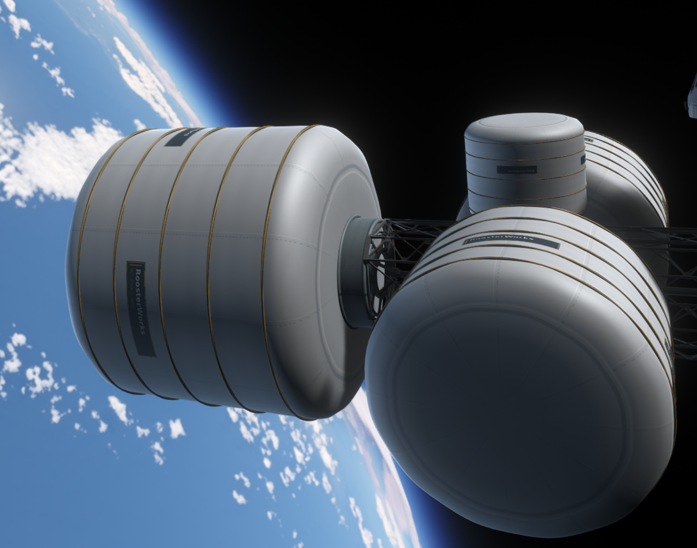

# RoosterWorks InflataDepot

**Deployable orbital fuel storage for Kerbal Space Program 1**  
**Version:** 1.0.0 · **Author:** SockedRooster · **License:** MIT

Turn a compact launch payload into a full-size orbital refueling depot. **InflataDepot** adds three pancake-shaped fuel tanks that expand into reinforced cylinders after deployment. Each tank has a single, integrated bottom docking interface, selectable fuel configurations, and safeguards to prevent fuel storage before inflation or deflation while fuel remains inside.

## Features

- **Compact launch, large storage:** Stow as a flat disc, then inflate into a cylinder in about 20 seconds.
- **Three sizes:** 1.25 m, 2.5 m, and 3.75 m launch diameters.
- **Two fuel configurations in one part:** Select **LF + Oxidizer** or **Liquid Fuel Only** in the VAB with B9 Part Switch.
- **Deployment-locked storage:** Tanks have zero usable capacity while stowed or inflating. Once fully deployed, capacity becomes available, but the tank remains empty until refueled.
- **Safe deflation:** Deflation is blocked until Liquid Fuel and Oxidizer are both completely drained.
- **Functional docking:** A single bottom Clamp-O-Tron-compatible docking interface, sized for each tank.
- **Deployed collision:** The inflated cylinder has physical collision; the docking base has its own collider.
- **RoosterWorks styling:** Reinforced white fabric, gold restraints, branded nameplates, and sealed end caps.

## Tanks and capacities

| Part | Launch diameter | Docking compatibility | LF + Oxidizer | LF only |
| --- | ---: | --- | --- | ---: |
| **ID-125** | 1.25 m | Clamp-O-Tron Jr. (size0) | 1,012.5 LF + 1,237.5 OX | 2,250 LF |
| **ID-250** | 2.5 m | Clamp-O-Tron (size1) | 8,100 LF + 9,900 OX | 18,000 LF |
| **ID-375** | 3.75 m | Clamp-O-Tron Sr. (size2) | 27,337.5 LF + 33,412.5 OX | 60,750 LF |

Each row is **one part** in the VAB, not separate LF and LF/OX variants. All tanks begin empty.

## Requirements

- **Kerbal Space Program 1** — release targets **KSP 1.12.5**
- **[B9 Part Switch](https://github.com/blowfishpro/B9PartSwitch)** — required for fuel selection
- **[ModuleManager](https://github.com/sarbian/ModuleManager)** — required for configuration patches
- **[VAB Organizer](https://github.com/KSPModStewards/VABOrganizer)** — optional; groups the tanks under **Fuel Tanks → Rocket Fuel**

In the stock editor, look under **Fuel Tanks**. In Career mode, the parts unlock at **Advanced Fuel Systems** (`advFuelSystems`, 160-science tier).

## Installation

### Manual installation

1. Download **[`InflataDepot-v1.0.0.zip`](https://github.com/SockedRooster/KSP-Inflatable-Fuel-Depots/releases/download/v1.0.0/InflataDepot-v1.0.0.zip)** from the [v1.0.0 release](https://github.com/SockedRooster/KSP-Inflatable-Fuel-Depots/releases/tag/v1.0.0).
2. Quit KSP and back up existing saves and craft files if upgrading from a beta.
3. Remove any existing `GameData/InflataDepot` folder. **Do not merge old beta files.**
4. Extract the release ZIP into your **KSP installation directory**, so the plugin ends up at `GameData/InflataDepot/Plugins/InflataDepotPlugin.dll`.
5. Make sure **B9 Part Switch** and **ModuleManager** are installed, then start KSP.

**CKAN:** When InflataDepot is indexed, install it through CKAN instead; CKAN will handle required dependencies. Until then, use the GitHub release ZIP above.

## How to use

1. In the VAB, choose an **ID-125**, **ID-250**, or **ID-375** depot from **Fuel Tanks**.
2. Select **Fuel Configuration** in the part menu: **LF + Oxidizer** or **Liquid Fuel Only**.
3. Launch the depot folded and empty. Place it where it has room to expand.
4. In flight, choose **Inflate Fuel Depot**. Wait until deployment finishes.
5. Transfer fuel from tankers or another connected vessel. **Inflation does not generate fuel.**
6. To deflate, **drain the tank completely first**. Deflation is blocked whenever fuel remains inside.

## Compatibility and important notes

- **Inflate in clear space.** The deployed cylinder has collision, and deploying through overlapping parts or nearby craft may cause strong physics forces.
- The docking interface is located **only at the bottom**. When attached to another stack part, that interface cannot simultaneously act as a free docking port.
- Existing action groups created with older betas may need to be reassigned to the guarded inflate/deflate commands.
- Older beta craft using the former separate `_LF` part identifiers may require rebuilding or manual migration.
- This release was tested in the author's KSP installation. Broad compatibility with other mod combinations, including Kerbalism, is not guaranteed.

## Roadmap

Future updates may add additional resource configurations, including Monopropellant, Xenon, and compatible cryogenic fuels. These are **not part of v1.0.0**.

## Support and source

- **Issues and bug reports:** [GitHub Issues](https://github.com/SockedRooster/KSP-Inflatable-Fuel-Depots/issues)
- **Releases:** [GitHub Releases](https://github.com/SockedRooster/KSP-Inflatable-Fuel-Depots/releases)
- **Source code:** [`Source/InflataDepotPlugin/`](Source/InflataDepotPlugin/), [`Source/build.py`](Source/build.py), and [`Source/test_assets.py`](Source/test_assets.py)
- **Changelog:** [CHANGELOG.md](CHANGELOG.md)

**Copyright © 2026 SockedRooster. Licensed under the [MIT License](LICENSE).**

InflataDepot does not redistribute KSP/Unity game libraries or its third-party dependencies.
